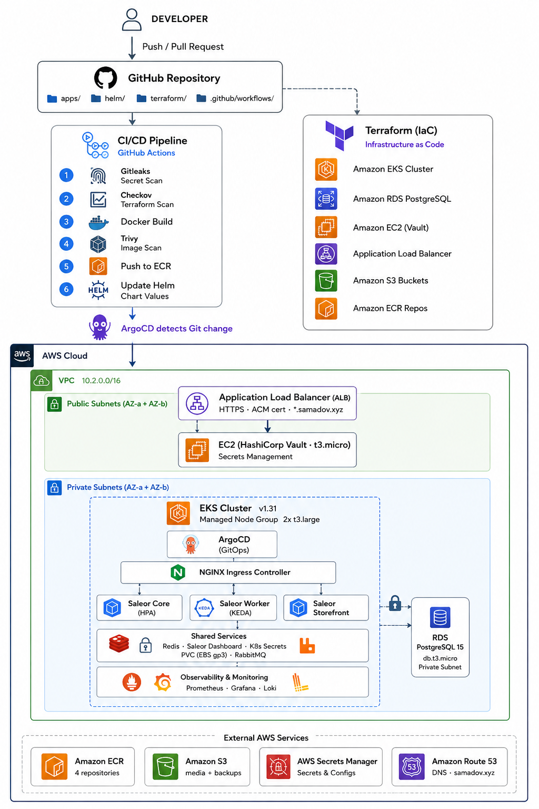
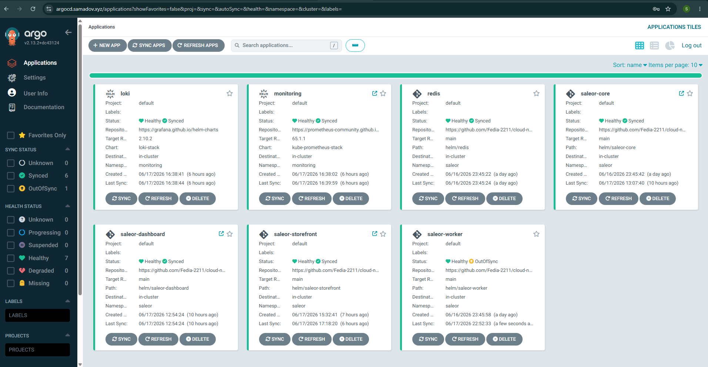
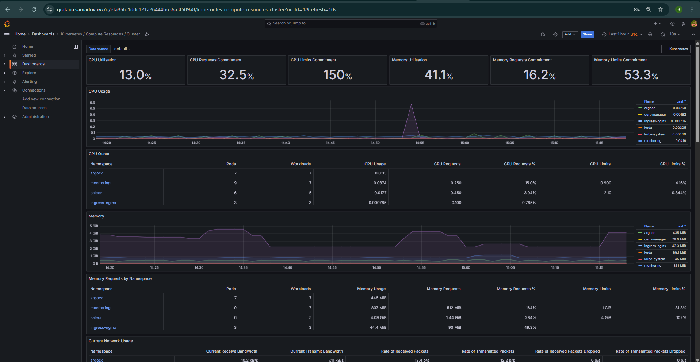
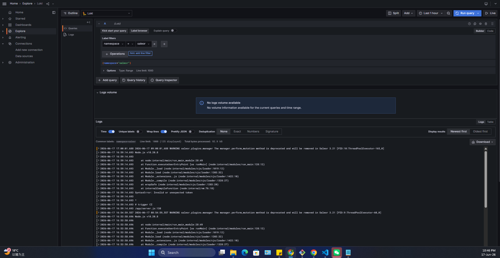
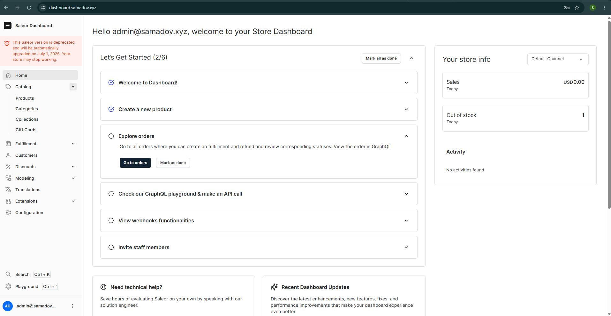
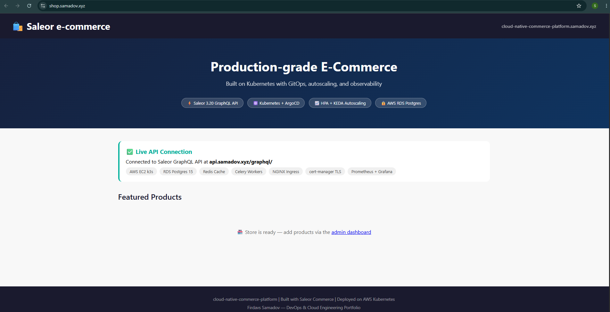
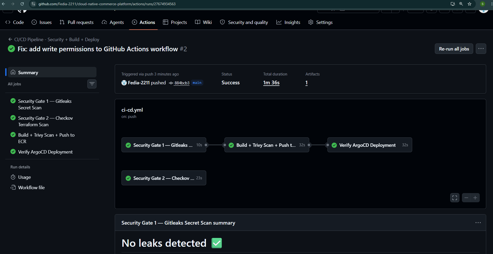
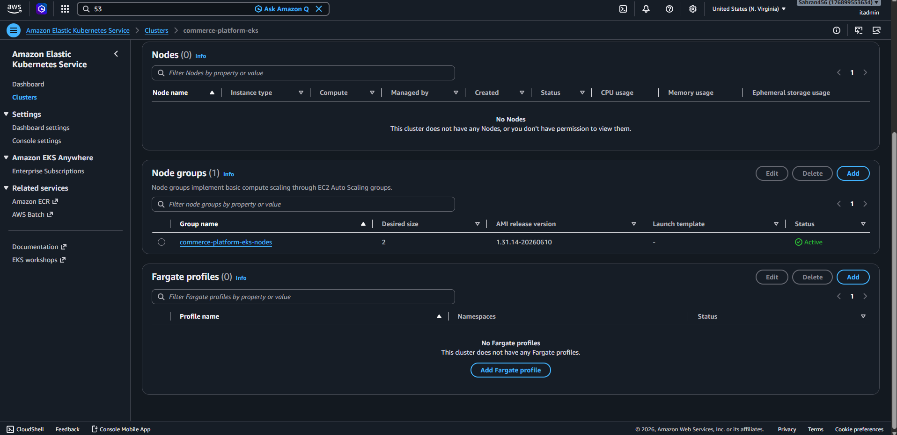

# cloud-native-commerce-platform

> Production-grade cloud-native e-commerce platform on AWS — Saleor Commerce deployed on Kubernetes with GitOps, autoscaling (HPA + KEDA), DevSecOps CI/CD pipeline, full observability stack, and multi-environment deployment (k3s self-managed + AWS EKS managed).

---

## Live Services (k3s Environment)

| Service | URL | Description |
|---------|-----|-------------|
| Storefront | https://shop.samadov.xyz | Customer-facing e-commerce shop |
| GraphQL API | https://api.samadov.xyz/graphql/ | Saleor Commerce GraphQL API |
| Admin Dashboard | https://dashboard.samadov.xyz | Store management panel |
| ArgoCD | https://argocd.samadov.xyz | GitOps deployment dashboard |
| Grafana | https://grafana.samadov.xyz | Kubernetes monitoring |

## Live Services (EKS Environment)

| Service | URL | Description |
|---------|-----|-------------|
| Storefront | https://eks-shop.samadov.xyz | Same app, EKS cluster |
| GraphQL API | https://eks-api.samadov.xyz/graphql/ | Saleor API on managed Kubernetes |
| Admin Dashboard | https://eks-dashboard.samadov.xyz | Dashboard on EKS |

> Infrastructure is stopped when not in use to minimize AWS costs. Full environment redeploys from scratch using Terraform + Helm in under 25 minutes.

---

## Architecture

```
### System Architecture
Infrastructure diagram showing VPC topology, EC2 instances, RDS database, and AWS service integrations.



```

---

## Tech Stack

| Category | Technology |
|----------|-----------|
| Cloud | AWS — EC2, EKS, RDS, ECR, S3, IAM, Route 53, VPC |
| IaC | Terraform 1.x — 7 modules (vpc, compute, security, rds, s3, ecr, iam) |
| Kubernetes (self-managed) | k3s v1.35 — 2-node cluster (m7i-flex.large) |
| Kubernetes (managed) | AWS EKS v1.31 — managed node group |
| GitOps | ArgoCD v2.13 — automated sync, self-heal |
| CI/CD | GitHub Actions — 4-stage security pipeline |
| Security scanning | Gitleaks + Checkov + Trivy |
| Ingress | NGINX Ingress Controller |
| TLS | cert-manager + Let's Encrypt (auto-renewing) |
| Monitoring | kube-prometheus-stack (Prometheus + Grafana) |
| Log aggregation | Loki + Promtail |
| Autoscaling | HPA (CPU-based) + KEDA (queue-based) |
| Message queue | Redis (Celery broker) |
| Database | AWS RDS Postgres 15 |
| Container registry | AWS ECR (4 repos, scan on push, AES256 encrypted) |
| Application | Saleor Commerce 3.20 (Django GraphQL API + React Dashboard + Node.js storefront) |
| Packaging | Helm 3 — custom charts for all services |
| OS | Ubuntu 22.04 LTS |
| Domain | samadov.xyz via Route 53 |

---

## Project Structure

```
cloud-native-commerce-platform/
├── terraform/
│   ├── modules/
│   │   ├── vpc/           # VPC, subnets (2 AZs), NAT gateway
│   │   ├── compute/       # k3s server + agent (m7i-flex.large)
│   │   ├── security/      # Security groups per service
│   │   ├── rds/           # RDS Postgres 15
│   │   ├── s3/            # Media + backups buckets
│   │   ├── ecr/           # 4 ECR repositories
│   │   ├── iam/           # Node roles, GitHub Actions user
│   │   ├── eks/           # EKS cluster + managed node group + addons
│   │   ├── eks-security/  # EKS-specific security groups
│   │   └── vault-ec2/     # HashiCorp Vault on t3.micro
│   └── environments/
│       ├── production/    # k3s deployment
│       └── eks/           # EKS deployment (separate state)
├── helm/
│   ├── saleor-core/       # Django GraphQL API + HPA
│   ├── saleor-worker/     # Celery worker + KEDA ScaledObject
│   ├── saleor-storefront/ # Node.js storefront
│   ├── saleor-dashboard/  # React admin panel
│   └── redis/             # Redis cache + Celery broker
├── kubernetes/
│   └── argocd-apps/       # ArgoCD Application manifests
│       ├── redis.yaml
│       ├── saleor-core.yaml
│       ├── saleor-worker.yaml
│       ├── saleor-storefront.yaml
│       ├── saleor-dashboard.yaml
│       ├── monitoring.yaml
│       └── loki.yaml
├── apps/
│   └── storefront/        # Custom Node.js storefront (CI/CD demo)
│       ├── server.js
│       └── Dockerfile
└── .github/
    └── workflows/
        └── ci-cd.yml      # 4-stage security pipeline
```

---

## CI/CD Security Pipeline

Every push to `main` triggers a 4-stage pipeline:

```
Stage 1 — Gitleaks Secret Scanning
    No secrets/credentials committed to Git
    BLOCKS if leaked secrets detected

Stage 2 — Checkov Terraform Scanning (parallel)
    Scans all Terraform modules for misconfigurations
    Results: IMDSv2 enforced, EBS optimized, monitoring enabled
    soft_fail=true (reports findings, doesn't block)

Stage 3 — Build + Trivy Container Scan
    Builds Docker image
    Trivy scans for CRITICAL/HIGH CVEs
    Pushes to AWS ECR only if scan passes

Stage 4 — ArgoCD Deployment Verification
    Updates Helm values with new image SHA
    ArgoCD auto-syncs to cluster
    Health check verifies deployment succeeded
```

**Checkov Security Findings (Resolved vs Accepted):**

| Finding | Status | Action |
|---------|--------|--------|
| `CKV_AWS_79` — IMDSv2 not enforced | ✅ Fixed | `http_tokens = "required"` on EC2 |
| `CKV_AWS_126` — No detailed monitoring | ✅ Fixed | `monitoring = true` on EC2 |
| `CKV_AWS_135` — Not EBS optimized | ✅ Fixed | `ebs_optimized = true` on EC2 |
| `CKV_AWS_51` — ECR tags mutable | ⚠️ Accepted | Immutable tags break CI pipeline in dev |
| `CKV_AWS_136` — ECR not KMS encrypted | ⚠️ Accepted | AES256 used; KMS adds cost |

---

## Autoscaling

### HPA — Horizontal Pod Autoscaler (saleor-core)

Scales API pods based on CPU utilization:

```yaml
minReplicas: 2
maxReplicas: 4
metrics:
- type: Resource
  resource:
    name: cpu
    target:
      averageUtilization: 70
behavior:
  scaleDown:
    stabilizationWindowSeconds: 300  # prevent flapping
  scaleUp:
    stabilizationWindowSeconds: 60
```

### KEDA — Event-Driven Autoscaling (saleor-worker)

Scales Celery workers based on Redis queue depth:

```yaml
triggers:
- type: redis
  metadata:
    address: redis.saleor.svc.cluster.local:6379
    listName: celery
    listLength: "10"    # 1 worker per 10 queued tasks
minReplicaCount: 1
maxReplicaCount: 10
```

**Demo:** Push 50 tasks to Redis queue → KEDA scales workers from 1 → 5 automatically within 30 seconds.

---

## Deployment

### Prerequisites

- AWS account with IAM permissions
- Terraform 1.x
- kubectl
- SSH key pair in AWS EC2
- Domain in Route 53

### Step 1 — Deploy Infrastructure

```bash
cd terraform/environments/production
cp terraform.tfvars.example terraform.tfvars
# Edit with your values

terraform init
terraform plan    # Should show ~45 resources
terraform apply
```

### Step 2 — Install k3s Cluster

```bash
# SSH to server
ssh -i ~/.ssh/key.pem ubuntu@<SERVER_PUBLIC_IP>

# Install k3s (without Traefik — using NGINX)
curl -sfL https://get.k3s.io | INSTALL_K3S_EXEC="--disable=traefik" sh -

# Get join token
sudo cat /var/lib/rancher/k3s/server/node-token

# SSH to agent via server as jump host
ssh -J ubuntu@<SERVER_IP> ubuntu@<AGENT_PRIVATE_IP>
curl -sfL https://get.k3s.io | K3S_URL=https://<SERVER_PRIVATE_IP>:6443 K3S_TOKEN=<TOKEN> sh -
```

### Step 3 — Configure kubectl

```bash
# Get kubeconfig from server
sudo cat /etc/rancher/k3s/k3s.yaml
# Replace 127.0.0.1 with server public IP
# Save to ~/.kube/config

kubectl get nodes  # Should show 2 nodes Ready
```

### Step 4 — Install Platform Tools

```bash
# NGINX Ingress (on server node)
kubectl apply -f https://raw.githubusercontent.com/kubernetes/ingress-nginx/controller-v1.11.2/deploy/static/provider/baremetal/deploy.yaml
kubectl patch deployment ingress-nginx-controller -n ingress-nginx \
  -p '{"spec":{"template":{"spec":{"hostNetwork":true,"nodeSelector":{"kubernetes.io/hostname":"ip-10-2-1-224"}}}}}'

# cert-manager
kubectl apply -f https://github.com/cert-manager/cert-manager/releases/download/v1.15.3/cert-manager.yaml

# ArgoCD
kubectl create namespace argocd
kubectl apply -n argocd -f https://raw.githubusercontent.com/argoproj/argo-cd/v2.13.2/manifests/install.yaml
kubectl patch configmap argocd-cmd-params-cm -n argocd --type merge -p '{"data":{"server.insecure":"true"}}'

# KEDA
kubectl apply -f https://github.com/kedacore/keda/releases/download/v2.16.0/keda-2.16.0.yaml
```

### Step 5 — Create Secrets

```bash
kubectl create namespace saleor

kubectl create secret generic saleor-secrets --namespace saleor \
  --from-literal=SECRET_KEY=$(openssl rand -hex 32) \
  --from-literal=DB_HOST=<RDS_ENDPOINT> \
  --from-literal=DB_PORT=5432 \
  --from-literal=DB_NAME=saleor \
  --from-literal=DB_USER=saleor_admin \
  --from-literal=DB_PASSWORD=<DB_PASSWORD> \
  --from-literal=REDIS_URL=redis://redis:6379/0 \
  --from-literal=CELERY_BROKER_URL=redis://redis:6379/1

# ECR pull secret (expires every 12 hours)
TOKEN=$(aws ecr get-login-password --region us-east-1)
kubectl create secret docker-registry ecr-pull-secret --namespace saleor \
  --docker-server=<ACCOUNT_ID>.dkr.ecr.us-east-1.amazonaws.com \
  --docker-username=AWS --docker-password=$TOKEN

# RDS CA certificate
curl -o /tmp/rds-ca.pem https://truststore.pki.rds.amazonaws.com/global/global-bundle.pem
kubectl create configmap rds-ca-cert --namespace saleor --from-file=ca.pem=/tmp/rds-ca.pem
```

### Step 6 — Deploy via ArgoCD

```bash
# Deploy all applications
kubectl apply -f kubernetes/argocd-apps/

# ArgoCD auto-syncs everything from Git
# Monitor at https://argocd.samadov.xyz
```

### Step 7 — Create Admin User

```bash
kubectl exec -n saleor $(kubectl get pod -n saleor -l app=saleor-core \
  -o jsonpath='{.items[0].metadata.name}') -- python manage.py shell -c \
  "from django.contrib.auth import get_user_model; U = get_user_model(); \
   U.objects.create_superuser('admin@samadov.xyz', 'YourPassword'); print('done')"
```

### EKS Deployment

```bash
cd terraform/environments/eks
terraform init && terraform apply

# Configure kubectl for EKS
aws eks update-kubeconfig --region us-east-1 --name commerce-platform-eks

# Deploy same Helm charts — zero changes required
kubectl apply -f kubernetes/argocd-apps/
```

---

## Monitoring

Grafana at `https://grafana.samadov.xyz` — 20+ pre-built dashboards:

| Dashboard | Shows |
|-----------|-------|
| Kubernetes / Compute Resources / Cluster | CPU/memory by namespace |
| Kubernetes / Compute Resources / Node | Per-node breakdown |
| Node Exporter / Nodes | Disk, network, system metrics |
| Kubernetes / Networking / Pod | Pod network traffic |

**Loki log aggregation** — all pod logs from `saleor`, `argocd`, `monitoring`, `kube-system` namespaces searchable in Grafana Explore.

---

## Real Problems Solved

| Problem | Root Cause | Fix |
|---------|-----------|-----|
| NGINX Ingress stuck Pending | k3s ships with Traefik — port conflict | Deleted nginx-ingress, used native Traefik (Project 2) / disabled Traefik in Project 3 |
| NGINX admission webhook timeout | hostNetwork mode conflicts with webhook | `kubectl delete validatingwebhookconfiguration ingress-nginx-admission` |
| RDS SSL certificate rejection | Postgres 15 requires SSL by default | Downloaded Amazon RDS CA bundle, mounted as ConfigMap via `NODE_EXTRA_CA_CERTS` |
| RDS permission denied on schema | PG15 changed public schema defaults | `GRANT ALL ON SCHEMA public TO saleor_admin` |
| HPA infinite scaling loop | Memory metric fires on startup (Django loads all code immediately) | Removed memory metric, CPU-only HPA with stabilization windows |
| KEDA listLength type error | YAML integer vs string type mismatch | Changed to `listLength: "10"` (quoted string) |
| ArgoCD empty ConfigMap | `.pem` files in `.gitignore` | Added `!helm/wikijs/files/rds-ca.pem` exception |
| EKS nodes can't reach RDS | AWS creates its own node SG, ignoring Terraform SG | Added auto-created node SG `sg-005934df08848e06b` to RDS ingress rules |
| GitHub Actions push rejected | ArgoCD commits while CI pushes — race condition | Added `git stash → git pull --rebase → git stash pop` before push |
| Saleor OOMKilled | Memory limit too low for Django startup | Increased limit from 512Mi to 1.5Gi |
| Bash comments in server.js | `echo "# trigger CI" >> server.js` appends bash comment to JS | Use `// comment` syntax in JS files |
| NGINX Ingress on wrong node | Scheduler placed controller on agent (private subnet) | `nodeSelector: kubernetes.io/hostname: ip-10-2-1-224` |

---

## Multi-Environment Portability

The same Helm charts deployed to both environments with **zero changes**:

| Feature | k3s (self-managed) | EKS (managed) |
|---------|-------------------|---------------|
| Kubernetes distribution | k3s v1.35 | EKS v1.31 |
| Node type | m7i-flex.large EC2 | t3.medium managed nodes |
| Ingress | NGINX + hostNetwork | NGINX + AWS NLB (auto-provisioned) |
| Storage | local-path-provisioner | EBS CSI driver (gp3) |
| Load balancer | Direct IP + Route 53 | AWS NLB auto-created |
| Cost | ~$4/day | ~$8/day |

---

## Cost

| Resource | Daily cost (running) |
|----------|---------------------|
| 2x m7i-flex.large (k3s) | ~$6.50 |
| RDS db.t3.micro | $0.60 |
| NAT Gateway | $1.08 |
| S3 + ECR | ~$0.10 |
| **Total** | **~$8.30/day** |

Stopped overnight (EC2 + RDS): ~$1.18/day baseline. Full week cost: ~$20.

---

## Screenshots

### ArgoCD — All 7 Applications Healthy & Synced


### Grafana — Kubernetes Cluster Resources


### Grafana — Node Exporter System Metrics


### Saleor Admin Dashboard


### Saleor Storefront — Live API Connection


### GitHub Actions — DevSecOps Pipeline Success


### AWS EKS Console — Managed Node Group Active


---

## Author

**Firdavs Samadov**
DevOps & Cloud Engineering 

[GitHub](https://github.com/Fedia-2211) · [LinkedIn](https://www.linkedin.com/in/firdavs-samadov-0b82603b6/)
